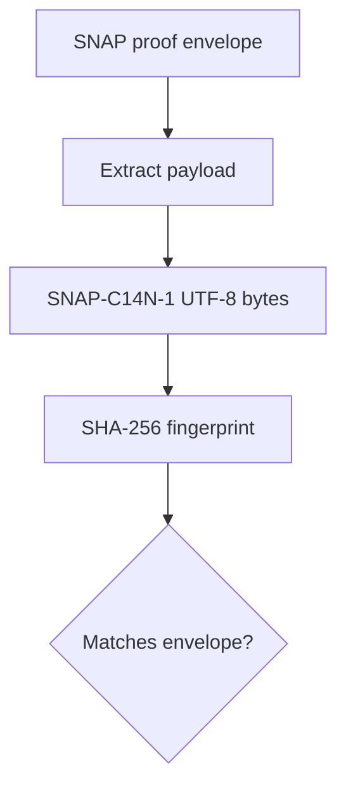

# Syntalium Public Proof Layer

[](https://github.com/syntalium/Syntalium/actions/workflows/proof-verification.yml)

Syntalium publishes an independent, reproducible integrity check for a SNAP
proof envelope:



This repository deliberately exposes the proof contract, not the private
intelligence engine.

## Public proof you can reproduce

Requirements: Python 3.11 or newer. The verifier uses only the Python standard
library.

Clone the repository and verify the sanitized synthetic fixture:

```bash
git clone https://github.com/syntalium/Syntalium.git
cd Syntalium
python verify_snap.py examples/snap-proof-v1.synthetic.json
```

Expected result:

```json
{"fingerprint_sha256": "1e7d5a27400466af1910055656d0e9bb07d5d416ab137f3901c8ee47a31aa5f8", "ok": true, "spec_version": "SNAP-PROOF-1", "status": "verified"}
```

Run the complete test suite:

```bash
python -m unittest discover -s tests -v
```

No dependency installation, secret, private API, VPS, model, or production
engine is required.

## Tamper test

Create a copy in which one payload value is changed but the original
fingerprint remains:

```bash
python -c "import json; from pathlib import Path; source=Path('examples/snap-proof-v1.synthetic.json'); data=json.loads(source.read_text(encoding='utf-8')); data['payload']['symbol']='BTCUSDU'; Path('tampered.json').write_text(json.dumps(data, ensure_ascii=False, indent=2)+'\n', encoding='utf-8')"
python verify_snap.py tampered.json
```

The second command returns structured output with
`"status": "fingerprint_mismatch"` and exit code `1`. Object key reordering or
insignificant source whitespace does not change the fingerprint; changing a
payload key, value, string, or array order does.

## Public components

- [Canonicalization contract](docs/SNAP_CANONICALIZATION_V1.md)
- [Public proof-layer architecture](docs/PUBLIC_PROOF_ARCHITECTURE.md)
- [JSON Schema](schemas/snap-proof-v1.schema.json)
- [Synthetic sanitized fixture](examples/snap-proof-v1.synthetic.json)
- [Independent verifier](verify_snap.py)
- [Automated tests](tests/test_verify_snap.py)
- [GitHub Actions workflow](.github/workflows/proof-verification.yml)
- [Security and disclosure policy](SECURITY.md)
- [GitHub Actions runs](https://github.com/syntalium/Syntalium/actions/workflows/proof-verification.yml)

## Verification contract

The envelope declares:

- `spec_version`: `SNAP-PROOF-1`;
- `hash_algorithm`: `SHA-256`;
- `canonicalization`: `SNAP-C14N-1`;
- `payload`: the only value that is canonicalized and hashed;
- `fingerprint_sha256`: the expected 64-character lowercase hexadecimal
  fingerprint.

The verifier rejects duplicate JSON keys, floating-point and non-finite numbers,
unknown envelope members, malformed metadata, and malformed fingerprints. It
uses a constant-time fingerprint comparison and stable JSON output.

CLI exit codes:

| Code | Meaning |
| ---: | --- |
| `0` | Fingerprint matches |
| `1` | Valid proof envelope, but fingerprint does not match |
| `2` | Invalid JSON, input error, or contract violation |

## Disclosure boundary

| Public in this repository | Not published |
| --- | --- |
| Canonicalization contract | Private SignalX/Syntalium engine |
| JSON Schema | Models, weights, checkpoints, and training data |
| Sanitized synthetic fixture | Exact feature formulas, weights, and thresholds |
| Independent verifier and tests | Entry, SL, TP, execution, and trading rules |
| Minimal CI workflow | Secrets, `.env`, databases, logs, IPs, and deployment configuration |

See [SECURITY.md](SECURITY.md) before proposing public material.

## What this proves

A green local or GitHub Actions verification proves that the published payload
is deterministically canonicalized to UTF-8 bytes, hashed with SHA-256, and
detectably fails against its original fingerprint after a payload change.

## What this does not prove

This repository does **not** prove:

- AI-model accuracy or forecast quality;
- real or future profitability;
- operation of the complete private production engine;
- the original publication time without separate timestamp evidence;
- any future market result.

The included record is explicitly
`fixture_kind: synthetic_sanitized`. It is test data, not a production record,
trade, signal, or performance claim.

## Responsible use

Syntalium provides market intelligence and publication-integrity tooling. It
does not guarantee returns and does not provide individualized financial
advice. Crypto markets involve substantial risk.
