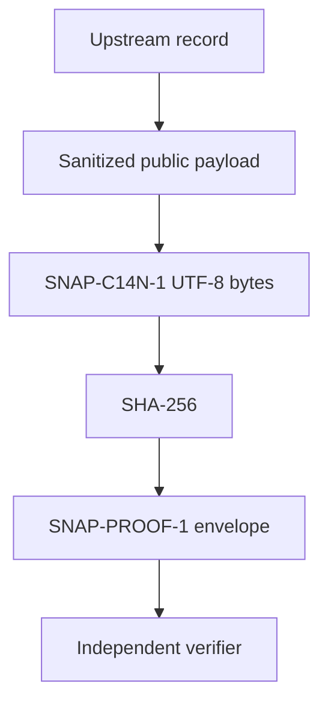

# Public Proof-Layer Architecture

## Purpose

This document explains the boundary and data flow of the open Syntalium proof
layer. It describes only the public integrity mechanism implemented in this
repository. It does not describe or reproduce the private intelligence engine,
model, feature pipeline, forecasting logic, trading rules, or production
infrastructure.

The normative format is defined by
[SNAP Canonicalization V1](SNAP_CANONICALIZATION_V1.md). If this overview and
the normative contract ever differ, the normative contract takes precedence.

## Data Flow

`Upstream record` is a boundary label, not a claim that the private production
engine is reproduced or tested here. The public repository starts with the
sanitized `payload` and contains no implementation of the upstream
intelligence process.

## Public Components

### Sanitized payload

The public input to the proof mechanism is the envelope's `payload` object.
Only `payload` is canonicalized and hashed. Envelope metadata and the expected
fingerprint are not part of the hashed bytes.

The included
[fixture](../examples/snap-proof-v1.synthetic.json) is explicitly synthetic
and sanitized. It is not a production record, trade, signal, model output, or
performance result.

### Deterministic canonicalization

`SNAP-C14N-1` sorts object keys, removes insignificant JSON whitespace,
preserves non-ASCII Unicode characters, and encodes the result as UTF-8.
Duplicate keys and floating-point values are rejected. The allowed recursive
JSON values are objects, arrays, strings, integers, booleans, and `null`.

### Fingerprint

SHA-256 is computed over the canonical UTF-8 bytes of `payload`. The digest is
encoded as 64 lowercase hexadecimal characters and stored in
`fingerprint_sha256`.

### Proof envelope

A `SNAP-PROOF-1` envelope has exactly five members:

| Member | Role |
| --- | --- |
| `spec_version` | Selects `SNAP-PROOF-1` |
| `hash_algorithm` | Selects `SHA-256` |
| `canonicalization` | Selects `SNAP-C14N-1` |
| `payload` | The only value canonicalized and hashed |
| `fingerprint_sha256` | The expected payload fingerprint |

The machine-readable envelope constraints are defined by the
[JSON Schema](../schemas/snap-proof-v1.schema.json).

### Independent verification

The standard-library-only [verifier](../verify_snap.py) validates the envelope,
recomputes the payload fingerprint, and compares it with the published value.
The [tests](../tests/test_verify_snap.py) cover deterministic
canonicalization, malformed input, duplicate keys, Unicode, and tamper
detection. GitHub Actions runs both the tests and fixture verification on
Python 3.11 and 3.12.

## Security Boundary

| Public proof layer | Outside this repository |
| --- | --- |
| Envelope format and JSON Schema | Private engine and production source |
| Canonicalization and SHA-256 rules | Models, weights, and training data |
| Independent verifier and tests | Feature formulas and thresholds |
| Synthetic sanitized fixture | Entry, SL, TP, execution, and trading rules |
| Minimal CI verification | Secrets, databases, logs, hosts, and deployment state |

No public endpoint or transport protocol is required by the proof contract. A
conforming JSON envelope can be verified locally without access to a private
API, service, model, or server.

## Evidence Boundary

A matching fingerprint shows that the presented payload deterministically
maps to the fingerprint carried by the envelope. Changing a payload key, value,
string character, or array order causes verification against the original
fingerprint to fail.

This mechanism alone does not prove:

- who created the record;
- when the record first existed or whether its timestamp is trustworthy;
- whether the payload describes true or complete source data;
- model accuracy, forecast quality, profitability, or a future market result;
- operation, security, or correctness of the private production engine.

Identity, trusted timestamping, source-data truth, and performance evaluation
require separate evidence and are not claims of this repository.
